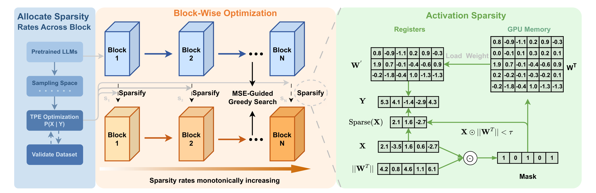
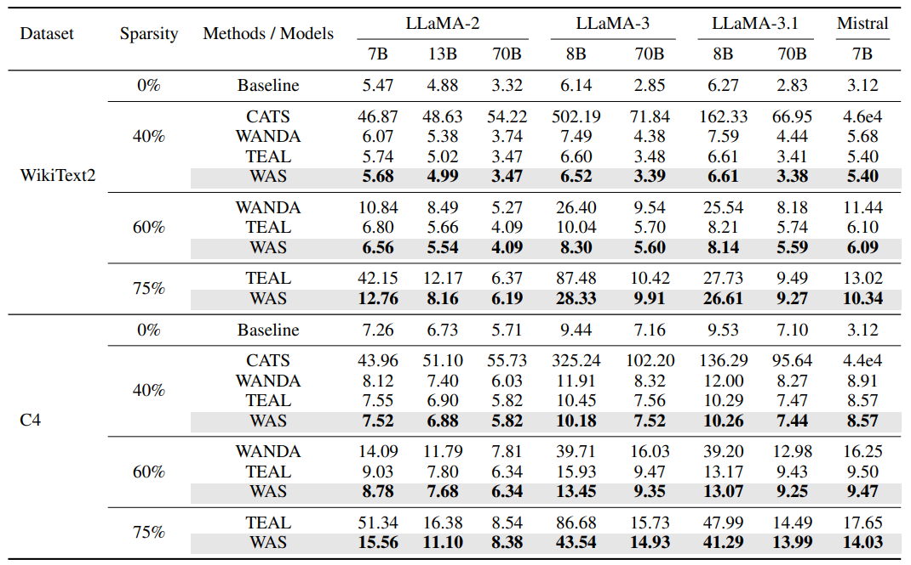
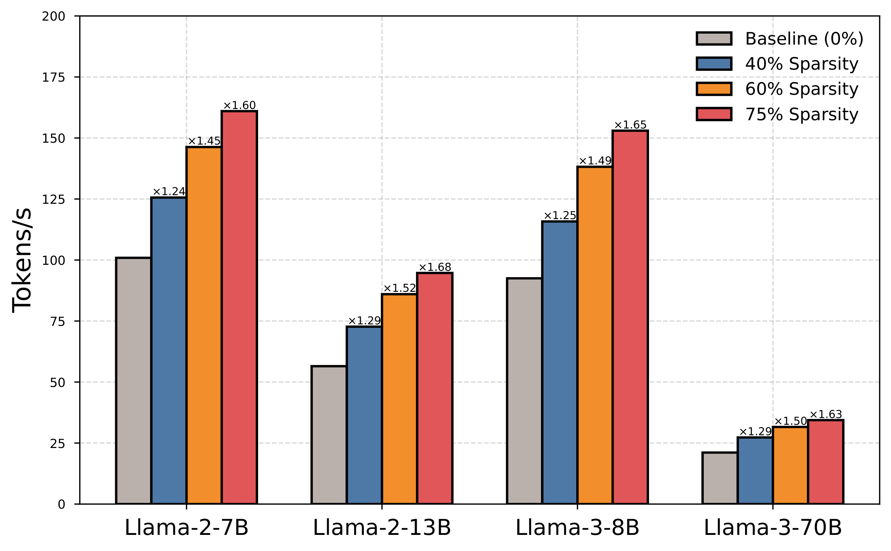

<div align="center">

# 🚀 WAS: Weight-Aware Activation Sparsity with Constrained Bayesian Optimization Scheduling for Large Language Models

**Ming Wang**, **[Miao Zhang](https://miaozhang0525.github.io/)**, **[Xuebo Liu](https://sunbowliu.github.io/)**, **[Liqiang Nie](https://liqiangnie.github.io/index.html)**\*  
Harbin Institute of Technology, Shenzhen  
\* Corresponding author

---

[](https://aclanthology.org/2025.emnlp-main.57/)
[](https://www.apache.org/licenses/LICENSE-2.0)

[](https://pytorch.org/get-started/locally/)

</div>

---

## 📋 Table of Contents

- [Introduction](#-introduction)
- [Method / Framework](#-method--framework)
- [Project Structure](#-project-structure)
- [Installation](#-installation)
- [Usage](#-usage)
- [Main Results](#-main-results)
- [Citation](#citation)
- [Acknowledgement](#-acknowledgement)
- [License](#-license)

---

## 📌 Introduction

Welcome to the official repository for **WAS**. This project provides the codebase of our EMNLP 2025 paper, offering a novel training-free weight-aware activation sparsity framework for accelerating LLM inference.

*Disclaimer: This codebase is intended for research purposes.*

---

## 🧠 Method / Framework



**Figure 1.** Overall framework of WAS. The method consists of three main stages: (1) weight-aware activation collection and histogram generation, (2) greedy optimization for component-wise sparsity allocation, and (3) TPE-based layer-wise sparsity optimization.

---

## 📂 Project Structure

```text
├── was/                                          # Core WAS module
│   ├── model.py                                  # Sparse model implementation
│   ├── grab_acts.py                              # Activation collection
│   ├── greedyopt.py                              # Greedy optimization
│   ├── tpe.py                                    # TPE-based optimization
│   ├── ppl_test.py                              # Evaluation script
│   ├── self_attn.py                              # Sparse self-attention
│   └── mlp.py                                   # Sparse MLP
├── kernels/                                      # Custom Triton kernels
│   ├── sparse_gemv.py
│   └── compile_wrapper.py
├── eval_test/                                    # Evaluation utilities
├── gpt-fast/                                    # Inference engine
│   ├── model.py
│   ├── generate.py
│   └── scripts
├── scripts/                                      # Executable scripts
├── utils/                                        # Utility functions
├── figs/                                          # Figures and results
├── pyproject.toml
└── LICENSE
```

---

## 📦 Installation

### 1. Clone the repository

```bash
git clone https://github.com/Ming0310/WAS.git
cd WAS
```

### 2. Create environment with conda

```bash
conda create -n was python=3.11
conda activate was
```

### 3. Install dependencies

```bash
pip install -e .
```

---

## 🚀 Usage

We provide a complete workflow in the `scripts/` directory. Follow these steps in order:

### Step 1: Collect Weight-Aware Activations

```bash
# Modify MODEL_NAME in the script to point to your HuggingFace model

bash scripts/grab_acts.bash
```

### Step 2: Greedy Optimization for Component Allocation

```bash
bash scripts/greedy.bash
```

### Step 3: TPE-Based Layer Sparsity Allocation

```bash
bash scripts/tpe.bash
```

### Step 4: Evaluation

```bash
bash scripts/evaluate.bash
```

### Step 5: Kernel Speedup (Single Batch, Optional)

```bash
cd gpt-fast
bash scripts/prepare.sh
bash run.sh
```

---

## 📊 Main Results

### Perplexity Results



### Speedup Results



---

## Citation

If you find this work useful in your research, please cite our paper:

```bibtex
@inproceedings{wang-etal-2025-weight,
    title = {Weight-Aware Activation Sparsity with Constrained {B}ayesian Optimization Scheduling for Large Language Models},
    author = {Wang, Ming and Zhang, Miao and Liu, Xuebo and Nie, Liqiang},
    booktitle = {Proceedings of the 2025 Conference on Empirical Methods in Natural Language Processing (EMNLP)},
    pages = {1086--1098},
    year = {2025},
    address = {Suzhou, China},
    publisher = {Association for Computational Linguistics}
}
```

---

## 🙏 Acknowledgement

This codebase is heavily built upon [TEAL](https://github.com/FasterDecoding/TEAL), [gpt-fast](https://github.com/pytorch-labs/gpt-fast) and [Optuna](https://github.com/optuna/optuna). We thank the authors for their excellent work and open-source contributions.

---

## 📄 License

This project is released under the Apache License 2.0. See [`LICENSE`](./LICENSE) for details.
